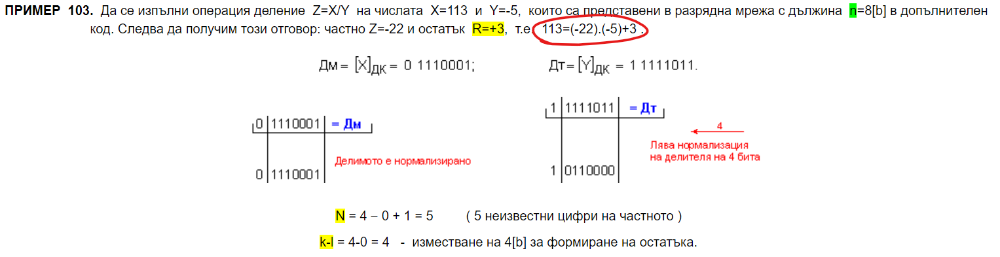
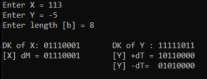
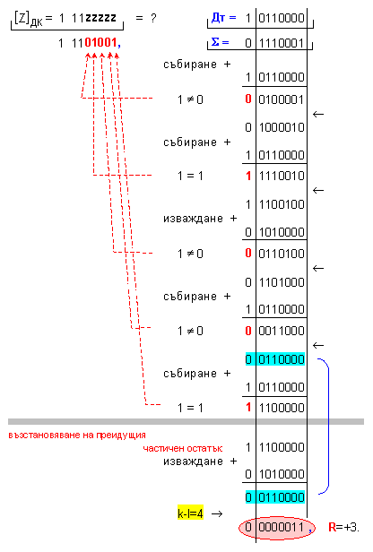
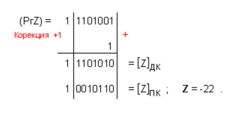
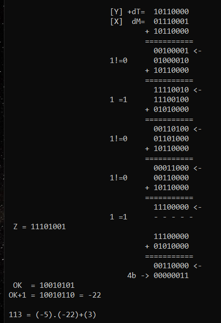

# Computer Organization

## Digital Arithmetics 

### Division using Two's Complement
[Program to solve the exercises](Division.cpp)

[Resource](http://www.tyanev.com/home.php?s=465&lang=bg&mid=18&mod=1&b=7)

 

